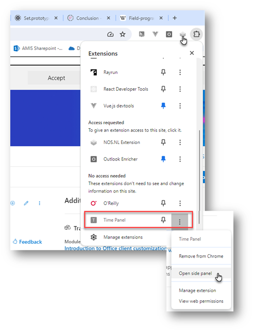
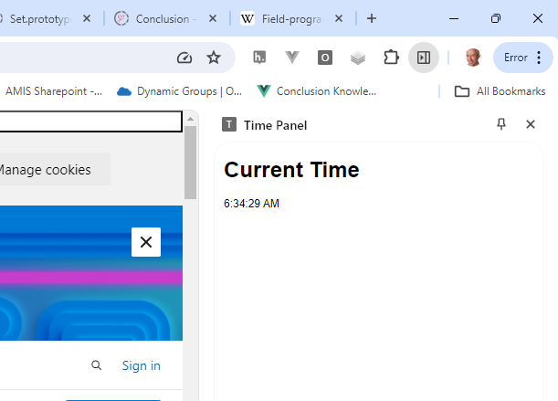

# Exploration of Chrome Extensions

This document will help you take your first steps with Chrome Extensions. It will provide instructions for creating, editing, inspecting and installing some simple Chrome Extensions that will help you get an an understanding of how extensions are createdm, what they can do and how they are developed and confiured.

You will find supporting details on Chrome Extensipn Development in [this slide deck](https://github.com/lucasjellema/presentations/raw/master/2024/CodeCafe-ChromeExtensionDevelopment.pptx) - prepared for the June 2024 Conclusion Code Cafe.

## First Chrome Browser Extension - Add a button in every web page

The first extension we will discuss is not incredubly useful. But it does show some important aspects of the browser extensions. Like how to create one (albeit the simplest one possible) and like how an extension can directly manipulate any page loaded in the browser. In this case in a silly way, but in any meaningful you want it to as well.  

Create a new folder. You can give it any name you like. I called it `add-button-extension`.

In this folder, create a file called `manifest.json`. This name needs to be spelled exactly right.

Add the following content to this file:
```
{
  "manifest_version": 3,
  "name": "Add button extension",
  "version": "1.0",
  "permissions": [
    "activeTab",
    "scripting"
  ],
  "content_scripts": [
    {
      "matches": ["<all_urls>"],
      "js": ["content.js"]
    }
  ]
}
```

This is the configuration of a new extension. It is called *Add button extension*. It needs permission to access the *activeTab* and to execute *scripting*. It executes the code in the file `content.js`, and it will execute for every page (every url).

Next, create the file `content.js` in the same folder. Add the following content to this file:
```
const body = document.querySelector("body");
body.innerHTML = '<button id="add-button">My Big Fat Button</button>'+body.innerHTML;
``` 
This code will add a `button` element in the `body` of the page loaded in the active browser tab. The button has a label *My Big Fat Button* - and nothing happens when it is pressed.

To add this extension in your browser, start Google Chrome. Type in the address bar: `chrome://extensions`. 

Click on the button *Load unpacked*.


In the file dialog that appears, select the folder that contains the extension files. Click on *Select Folder*. 

The extension will be added to your browser:


Now open any web page - for example a LinkedIn page, nu.nl, Google.com or Outlook Web Client.   


## Extension #2 - Side Panel with the current time

One component your extensions can have is a Side Panel. It is displayed on the right side, next to the pane that holds the web page. You determine the contents of the side panel, using plain HTML, CSS and JavaScript. Here you will create a very simple side panel, to see how it is done. In later extension you will see more advanced implementations.

The manifest.json is where you need to specify that your extension contains a side panel. Let's see this in action.

Create a new folder for this new extension.

Create a new file `manifest.json`. Add the following content:
```
{
  "manifest_version": 3,
  "name": "Time Panel",
  "version": "1.0",
  "description": "This extension displays a side panel with the current time",
  "permissions": ["sidePanel"],
  "side_panel": {
    "default_path": "side_panel.html"
  }
}
```

Only one permission is required - the one to show a side panel. The configuration of the side panel indicates which HTML document is to be loaded in the side panel: `side_panel.html`. 

Create this file `side_panel.html` in the same folder. Add this content:
```
<!DOCTYPE html>
<html>

<head>
  <title>Time Panel</title>
  <style>
    body {
      font-family: Arial, sans-serif;
      margin: 10px;
    }

    #content {
      white-space: pre-wrap;
    }
  </style>
</head>

<body>
  <h1>Current Time</h1>
  <div id="content"></div>
  <script src="side_panel.js"></script>
</body>

</html>
```

This content refers to another file, `side_panel.js`. This file needs to be created too. This is to be its contents:
```
document.addEventListener('DOMContentLoaded', function () {
    const contentDiv = document.querySelector('#content')
    setInterval(() => {
        const date = new Date();
        contentDiv.innerHTML = date.toLocaleTimeString();
    }, 1000);
}, false)
```
When the DOM is loaded, the DIV element with id `content` is located. And every second, the content of this DIV is updated with the current time. 

Save the three files. Then, as before, type in the address bar: `chrome://extensions`. 

Click on the button *Load unpacked*.


In the file dialog that appears, select the folder that contains the extension files. Click on *Select Folder*. 

This extension is added. To the side panel, you need to explicitly open it.

Once the side panel is activated like this, it will display :



## Resources

Accessing a page variable in Chrome Extension - read a variable in page and send its value to be used in content.js 
https://andreacassani.com/blog/access-page-variable-chrome-extension (included injecting script in page )

How to write and install your own Chrome extension
https://www.xda-developers.com/how-write-install-own-chrome-extension/

Implement custom context menu options
https://developer.chrome.com/docs/extensions/develop/ui/context-menu
and samples: basic https://github.com/GoogleChrome/chrome-extensions-samples/tree/main/api-samples/contextMenus/basic and locales: https://github.com/GoogleChrome/chrome-extensions-samples/tree/main/api-samples/contextMenus/global_context_search 

Chrome Extension Samples - [GitHub Repo](https://github.com/GoogleChrome/chrome-extensions-samples/blob/main/README.md)

Decode Chrome Extensions - Unveiling the Extensions: A Guide to Extracting Chrome Extension Source Code. - https://medium.com/@suriyakumar.vijayanayagam/unveiling-the-extensions-a-guide-to-extracting-chrome-extension-source-code-33e8f6956b43


Tutorial: Reading Time
https://github.com/GoogleChrome/chrome-extensions-samples/blob/main/functional-samples/tutorial.reading-time