# Exploration of Chrome Extensions

This document will help you take your first steps with Chrome Extensions. It will provide instructions for creating, editing, inspecting and installing some simple Chrome Extensions that will help you get an an understanding of how extensions are createdm, what they can do and how they are developed and confiured.

You will find supporting details on Chrome Extensipn Development in [this slide deck](https://github.com/lucasjellema/presentations/raw/master/2024/CodeCafe-ChromeExtensionDevelopment.pptx) - prepared for the June 2024 Conclusion Code Cafe.

## First Chrome Browser Extension - Add a button in every web page

The first extension we will discuss is not incredubly useful. But it does show some important aspects of the browser extensions. Like how to create one (albeit the simplest one possible) and like how an extension can directly manipulate any page loaded in the browser. In this case in a silly way, but in any meaningful you want it to as well.  

Create a new folder. You can give it any name you like. I called it `add-button-extension`.

In this folder, create a file called `manifest.json`. This name needs to be spelled exactly right.

Add the following content to this file:
```
{
  "manifest_version": 3,
  "name": "Add button extension",
  "version": "1.0",
  "permissions": [
    "activeTab",
    "scripting"
  ],
  "content_scripts": [
    {
      "matches": ["<all_urls>"],
      "js": ["content.js"]
    }
  ]
}
```

This is the configuration of a new extension. It is called *Add button extension*. It needs permission to access the *activeTab* and to execute *scripting*. It executes the code in the file `content.js`, and it will execute for every page (every url).

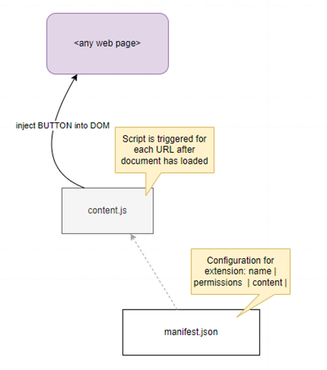

Next, create the file `content.js` in the same folder. Add the following content to this file:
```
const body = document.querySelector("body");
body.innerHTML = '<button id="add-button">My Big Fat Button</button>'+body.innerHTML;
``` 
This code will add a `button` element in the `body` of the page loaded in the active browser tab. The button has a label *My Big Fat Button* - and nothing happens when it is pressed.

To add this extension in your browser, start Google Chrome. Type in the address bar: `chrome://extensions`. 

Enable Developer Mode:
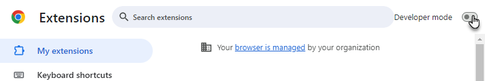

Click on the button *Load unpacked*.


In the file dialog that appears, select the folder that contains the extension files. Click on *Select Folder*. 

The extension will be added to your browser:


Now open any web page - for example a LinkedIn page, nu.nl, Google.com or Outlook Web Client.   


### Microsoft Edge Browser

Extensions developed for Google Chrome are essentially developed for the Chromium browser. And Edge too is a Chromium browser. Therefore, your Chrome Extensions are by definition also Edge Extensions, and you can activate them in similar steps:

Enable developmer mode, click *Load unpacked*, select the folder that contains the `manifest.json` file:
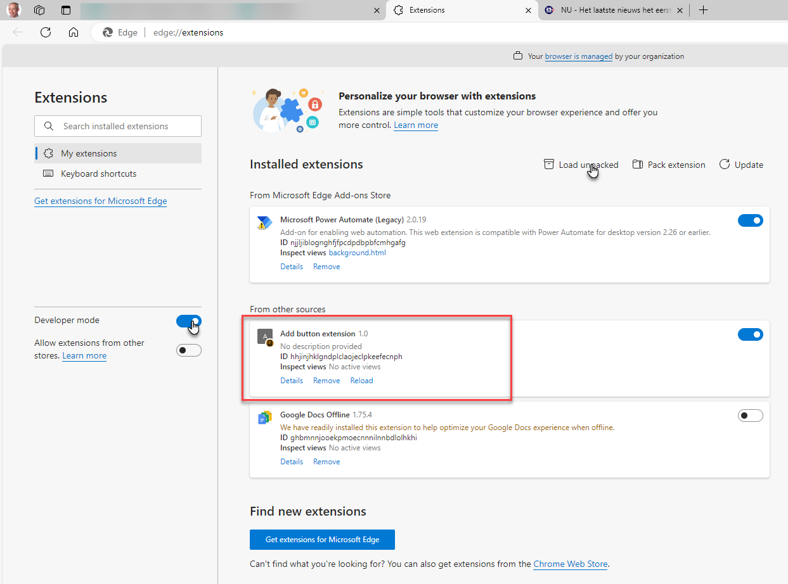
When you open a website in your Edge browser, you will get the same button decoration you saw earlier in Chrome:
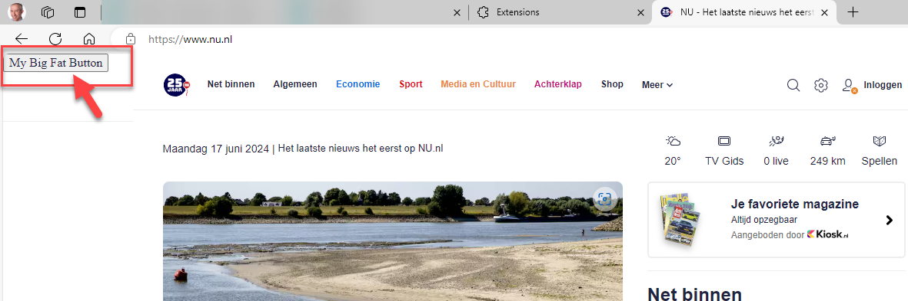


## Extension #2 - Side Panel with the current time

One component your extensions can have is a Side Panel. It is displayed on the right side, next to the pane that holds the web page. You determine the contents of the side panel, using plain HTML, CSS and JavaScript. Here you will create a very simple side panel, to see how it is done. In later extension you will see more advanced implementations.

The manifest.json is where you need to specify that your extension contains a side panel. Let's see this in action.

Create a new folder for this new extension.

Create a new file `manifest.json`. Add the following content:
```
{
  "manifest_version": 3,
  "name": "Time Panel",
  "version": "1.0",
  "description": "This extension displays a side panel with the current time",
  "permissions": ["sidePanel"],
  "side_panel": {
    "default_path": "side_panel.html"
  }
}
```

Only one permission is required - the one to show a side panel. The configuration of the side panel indicates which HTML document is to be loaded in the side panel: `side_panel.html`. 

Create this file `side_panel.html` in the same folder. Add this content:
```
<!DOCTYPE html>
<html>

<head>
  <title>Time Panel</title>
  <style>
    body {
      font-family: Arial, sans-serif;
      margin: 10px;
    }

    #content {
      white-space: pre-wrap;
    }
  </style>
</head>

<body>
  <h1>Current Time</h1>
  <div id="content"></div>
  <script src="side_panel.js"></script>
</body>

</html>
```

This content refers to another file, `side_panel.js`. This file needs to be created too. This is to be its contents:
```
document.addEventListener('DOMContentLoaded', function () {
    const contentDiv = document.querySelector('#content')
    setInterval(() => {
        const date = new Date();
        contentDiv.innerHTML = date.toLocaleTimeString();
    }, 1000);
}, false)
```
When the DOM is loaded, the DIV element with id `content` is located. And every second, the content of this DIV is updated with the current time. 

Save the three files. Then, as before, type in the address bar: `chrome://extensions`. 

Click on the button *Load unpacked*.


In the file dialog that appears, select the folder that contains the extension files. Click on *Select Folder*. 

This extension is added. To the side panel, you need to explicitly open it.

Once the side panel is activated like this, it will display :


## Extension 3 - Add Context Menu Option for Links - Show Link Details in Side Panel

This next extension adds an item to the context menu that the browser shows when a link (<a> element) is right or context clicked. This item - *Get Link Info* - triggers logic to locate the link element in the current page, read some of its properties and display those properties in the side panel. 
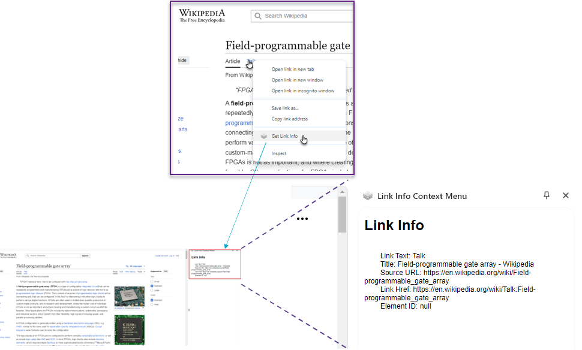

While the functionality described may not sound like much, the back and forth interaction between the menu item, the service worker (background script), the content script and the side panel is useful to understand. These components can only have message based, asynchronous communication, that you need to understand in order to attempt more complex extensions. The diagram of the components and their interaction looks like this:
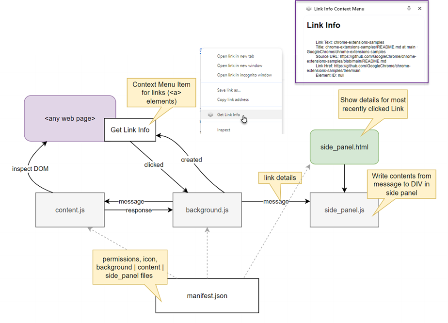


You will find a detailed description of this extension in [this document](https://github.com/lucasjellema/my-chrome-extension-exploration/tree/main/context-menu-clipboard).

## Extension 4 - News Site Manipulator

This extension is targeted specifically at the news site [nos.nl](https://nos.nl/). The extension does three things:
* it highlights all news items that contain user defined keywords
* it adds a button to every news items to have its details saved 
* it replaces all numbers with * (this to not immediately give away the football results) 

A visualization of the effect of the extension is shown here:
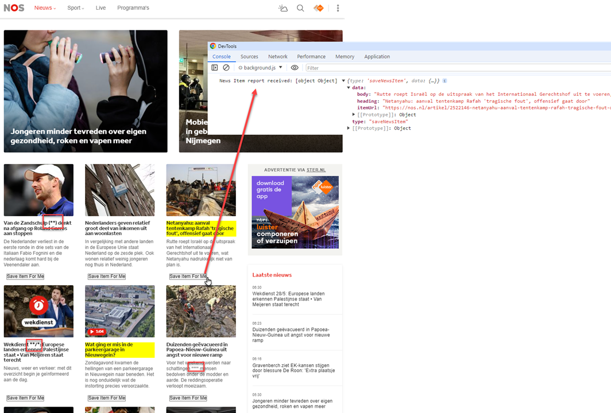

This extension has *settings* - parameters that are set through the extension management page in the browser:
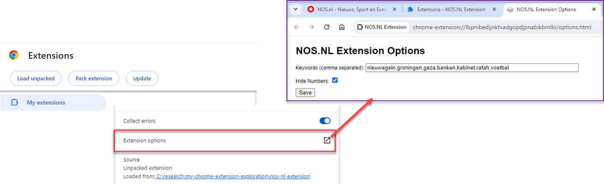

These settings are accessible to the extension at run time and can therefore drive the extension behavior. In this case, the extension setting consists of a list of keywords that should trigger highlighting a news item.

To recreate this extension, just as before: create a new folder.

In this folder, create a file called manifest.json.

Add the following content:
```
{
  "manifest_version": 3,
  "name": "NOS.NL Extension",
  "version": "1.0",
  "permissions": [
    "contextMenus",
    "activeTab",
    "scripting", "storage"
  ],
  "background": {
    "service_worker": "background.js"
  },
  "content_scripts": [
    {
      "matches": ["https://nos.nl/*"],
      "js": ["content.js"]
    }
  ],
  "options_page": "options.html",
  "action": {
    "default_icon": {
      "16": "icons/icon16.png",
      "48": "icons/icon48.png",
      "128": "icons/icon128.png"
    }
  },
  "icons": {
    "16": "icons/icon16.png",
    "48": "icons/icon48.png",
    "128": "icons/icon128.png"
  }
}
```
A few elements are new in this manifest file. The `options_page` for managing the settings, the `storage` permission (required to store t5he settings in the browser local storage) and the `service_worker` - the background script that ties various components together. 

Let's first look at the options page and the associated JavaScript logic.

Create file `options.html`:

```
<!DOCTYPE html>
<html>
<head>
  <title>NOS.NL Extension Options</title>
  <style>
    body {
      font-family: Arial, sans-serif;
      margin: 20px;
    }
    label {
      display: block;
      margin-bottom: 10px;
    }
  </style>
</head>
<body>
  <h1>NOS.NL Extension Options</h1>
  <label>
    Keywords (comma separated):
    <input type="text" id="highlightKeywords" placeholder="voetbal,kabinet,gaza" style="width: 500px"/>
  </label>
  <label>
    Hide Numbers:
    <input type="checkbox" id="hideNumbers" />
  </label>
  <button id="save">Save</button>

  <script src="options.js"></script>
</body>
</html>
```

This file define a very simple HTML page that contains to elements: a text input (to define a comma separated list of keywords) and a checkbox (to indicate whether numbers should be replaced with * or not).

It refers to the file `options.js` that you could create now:

```
// Save options to chrome.storage
function saveOptions() {
    const highlightKeywords = document.getElementById('highlightKeywords');
    const hideNumbers = document.getElementById('hideNumbers');
    const optionsToUpdate = {
        highlightKeywords: highlightKeywords.value,
        hideNumbers: hideNumbers.checked
    }
    console.log(`optionsToUpdate`, optionsToUpdate)
    chrome.storage.sync.set(optionsToUpdate, () => {
        // Update status to let user know options were saved.
        alert('Options saved.');
    });
}

// Restore options from chrome.storage
function restoreOptions() {
    chrome.storage.sync.get(['highlightKeywords', 'hideNumbers'], (items) => {
        console.log(`restore options`, items)
        document.getElementById('highlightKeywords').value = items.highlightKeywords || '';
        document.getElementById('hideNumbers').checked = items.hideNumbers || '';
    });
}

document.getElementById('save').addEventListener('click', saveOptions);
document.addEventListener('DOMContentLoaded', restoreOptions);
```

This file brings the HTML file to life. It reads the current option values from the local storage (`chrome.storage.sync.get`), populates the HTML elements and define the `click` handler for the *save* button. When the button is clickedm, the value in the HTML input elements are saved to the storage.

The `content.js` script - only active for the url pattern `https://nos.nl/*` - is where most of the action is. In this script, the options are read from storage. The script processes the current document, adding buttons to every news item, highlighting those news items whose title contains one of the keywords and hiding numbers in headings and bodies for news items (if the options so dictacte). Define the `content.js` script using this content:

```
const restoreOptions = (callforward) => {
  chrome.storage.sync.get(['highlightKeywords', 'hideNumbers'], (items) => {
    extensionOptions.highlightKeywords = items.highlightKeywords || ''
    extensionOptions.hideNumbers = items.hideNumbers || ''
    callforward()
  });
}

const extensionOptions = {}
const NEWS_ITEM_LI_CLASS = "sc-27eaedb2-0" //BRITTLE! This class name can change

const processNewsItems = async () => {
  const newsItems = document.getElementsByClassName(NEWS_ITEM_LI_CLASS)

  // highlight all items with one of the keywords in the title
  for (let i = 0; i < newsItems.length; i++) {
    const newsItemElement = newsItems[i]
    addButtonToNewsItem(newsItemElement)
    highlightItem(newsItemElement)
    if (extensionOptions.hideNumbers)  hideNumbers(newsItemElement)
  }
}

const highlightItem = (newsItemElement) => {
if (!extensionOptions.highlightKeywords) return
  const link = newsItemElement.getElementsByTagName('a')[0]
  // link has two direct div children; first one contains image  , the second the heading  (h2) and body (p)
  const keywords = extensionOptions.highlightKeywords.toLowerCase().split(',')
  if (link) {
    const headingElement = link.children[1].getElementsByTagName('h2')[0]
    if (!headingElement) return
    const headingText = headingElement.textContent
    // if heading text contains one of the keywords
    for (let i = 0; i < keywords.length; i++) {
      if (headingText.toLowerCase().includes(keywords[i])) {
        headingElement.style.backgroundColor = 'yellow'
      }
    }
  }
}


const hideNumbers = (newsItemElement) => {
  const link = newsItemElement.getElementsByTagName('a')[0]
  // link has two direct div children; first one contains image  , the second the heading  (h2) and body (p)
  if (link) {
    const headingElement = link.children[1].getElementsByTagName('h2')[0]
    if (!headingElement) return
    const headingText = headingElement.textContent
    // replace every digit in heading text with *
    headingElement.textContent = headingText.replace(/\d/g, '*')

    const bodyElement = link.children[1].getElementsByTagName('p')[0]
    const bodyText = bodyElement.textContent
    bodyElement.textContent = bodyText.replace(/\d/g, '*')
  }
}

const addButtonToNewsItem = (newsItemElement) => {

  const button = document.createElement('button');
  button.textContent = 'Save Item For Me';
  button.className = 'save-email-button';
  button.style.marginLeft = '10px';
  button.onclick = function () {

    const link = newsItemElement.getElementsByTagName('a')[0]
    // link has two direct div children; first one contains image  , the second the heading  (h2) and body (p)
    if (link) {
      const heading = link.children[1].getElementsByTagName('h2')[0].textContent
      const body = link.children[1].getElementsByTagName('p')[0].textContent
      const item = { heading, body, itemUrl: link.href }
      console.log(link, item)
      // send news item to background
      chrome.runtime.sendMessage({ type: 'saveNewsItem', data: item });
    }
  };
  newsItemElement.appendChild(button);
}

console.log(`content.js nos.nl extension loaded, go process news items`)
restoreOptions(processNewsItems)
```

Once the options have been read in `restoreOptions`, function `processNewsItems` is invoked to go over all news items (identified in a brittle method using what looks like a generated class name, one that can easily change between releases of the site). Each news item is given a button (function `addButtonToNewsItem`), is optionally highlighted (function `highlightItem`) and has its number replace if the options call for it (function `hideNumbers`).

In order to have the decoration of the news items respond to any change in the options values, you can add this snippet to file `content.js`: 
```
const listenForOptionChanges = () => {
  chrome.storage.onChanged.addListener((changes, namespace) => {
    console.log(`listener in CONTENT>JS for storage changes has fired`)
    let relevantChange = false
    for (let [key, { oldValue, newValue }] of Object.entries(changes)) {
      console.log(
        `Storage key "${key}" in namespace "${namespace}" changed.`,
        `Old value was "${oldValue}", new value is "${newValue}".`
      );
      if (key === 'highlightKeywords' || key === 'hideNumbers') {
        extensionOptions[key] = newValue
        relevantChange = true
      }
    }
    if (relevantChange) processNewsItems()
  });
}

listenForOptionChanges()
```

When the button added to each news item is pressed, the contents of the news item is sent as a message - to be picked up in the background service worker. The code that sends the news item in a message:
```
const heading = link.children[1].getElementsByTagName('h2')[0].textContent
      const body = link.children[1].getElementsByTagName('p')[0].textContent
      const item = { heading, body, itemUrl: link.href }
      console.log(link, item)
      // send news item to background
      chrome.runtime.sendMessage({ type: 'saveNewsItem', data: item });
```

Create file `background.js`. Add this content to the file:
```
chrome.runtime.onMessage.addListener((message, sender, sendResponse) => {  
  if (message.type === 'saveNewsItem') {
    console.log(`News Item report received: ${message}`, message);
    sendResponse({ status: 'success' });
  }
});
```

This code creates a message listener for the service worker. If the message handled has property called `type` and that property has the value `saveNewsItem`, the message contains the details for a news item to be saved. At this point, the code does nothing more useful than write the details to the console. Here it could also save the message to storage, invoke an API, make the message available to the side panel. I will leave that all up to you, dear reader.

The flow of information between the extension components is shown in this diagram:

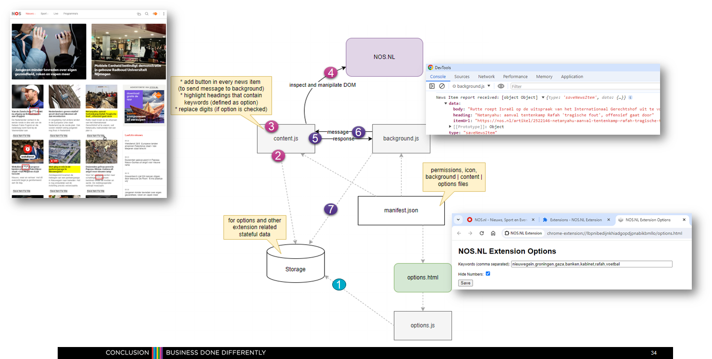


## Other Custom Chrome Extensions

Two additional extensions were prepared for this workshop. Not discussed to the same level of detail. However, the sources are available to inspect.

* [LinkedIn Summarizer](https://github.com/lucasjellema/my-chrome-extension-exploration/tree/main/linkedin-summarizer) - add a button to a LinkedIn profile page that when pressed creates a JSON summary of the profile details, presented in the side panel

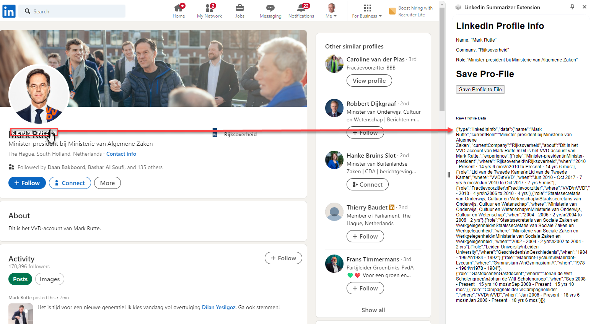

* [Link Crawler](https://github.com/lucasjellema/my-chrome-extension-exploration/tree/main/crawler) - crawl all pages linked from the current page and present a list of all titles of those pages (two different implementations of this extension are provided) - one using a hidden IFRAME and [an alternative one using a Browser Tab](https://github.com/lucasjellema/my-chrome-extension-exploration/tree/main/crawler-2) to visit all linked pages (to cater for sites that do not like being loaded in an IFRAME). The next image shows this extension in action.  

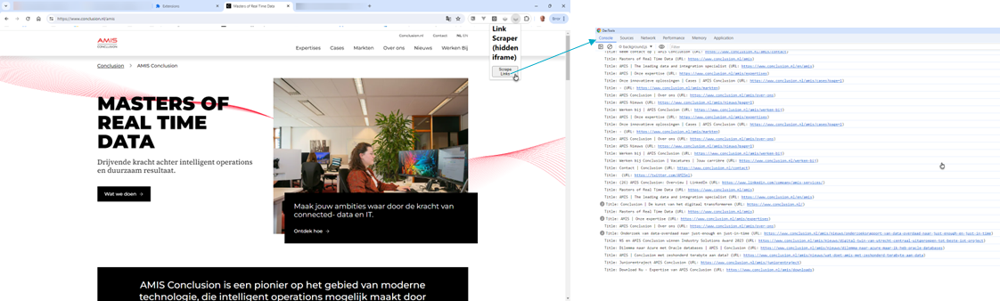

Of course there are many extensions available for the Chrome Browser. It is important to realize that you can install these extensions, not enable them (immediately) and inspect there sources. To know what exactly they will do - before you allow them to run inside your browser. And to learn from their implementation.

When you checked the installed extensions in your browser, you will find an extension id:
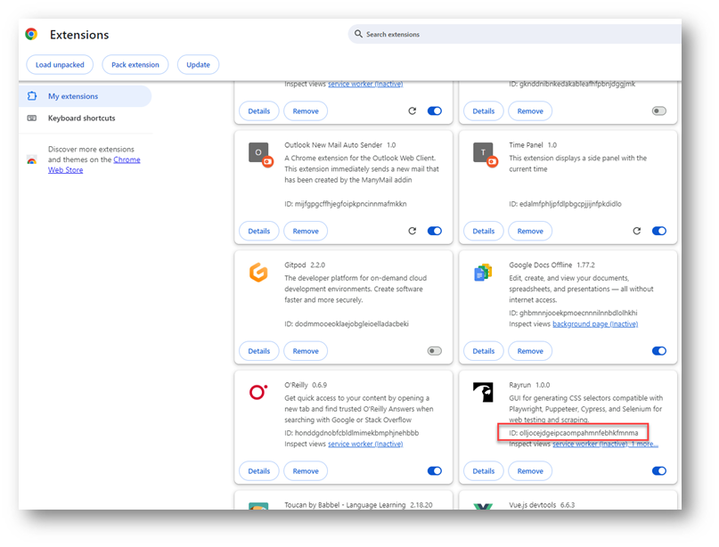
That id value corresponds with a directory name on your local disk. In that directory, you will find the source files for the extension. You will find a manifest.json and a subset of the files we have seen in this document - popup, options, background, content, sidepanel.

The directory to check for the extensions is: `C:\Users\<user>\AppData\Local\Google\Chrome\User Data\Default\Extensions`

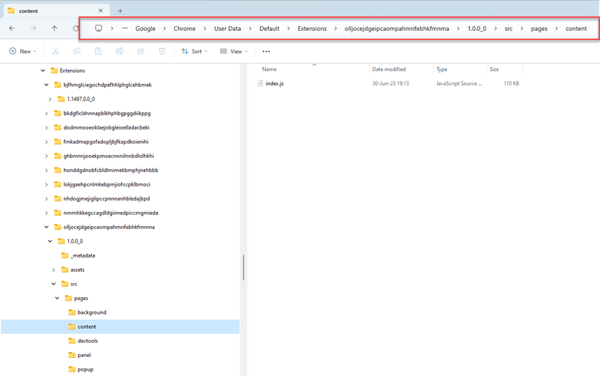


## Resources

Accessing a page variable in Chrome Extension - read a variable in page and send its value to be used in content.js 
https://andreacassani.com/blog/access-page-variable-chrome-extension (included injecting script in page )

How to write and install your own Chrome extension
https://www.xda-developers.com/how-write-install-own-chrome-extension/

Implement custom context menu options
https://developer.chrome.com/docs/extensions/develop/ui/context-menu
and samples: basic https://github.com/GoogleChrome/chrome-extensions-samples/tree/main/api-samples/contextMenus/basic and locales: https://github.com/GoogleChrome/chrome-extensions-samples/tree/main/api-samples/contextMenus/global_context_search 

Chrome Extension Samples - [GitHub Repo](https://github.com/GoogleChrome/chrome-extensions-samples/blob/main/README.md)

Decode Chrome Extensions - Unveiling the Extensions: A Guide to Extracting Chrome Extension Source Code. - https://medium.com/@suriyakumar.vijayanayagam/unveiling-the-extensions-a-guide-to-extracting-chrome-extension-source-code-33e8f6956b43


Tutorial: Reading Time
https://github.com/GoogleChrome/chrome-extensions-samples/blob/main/functional-samples/tutorial.reading-time