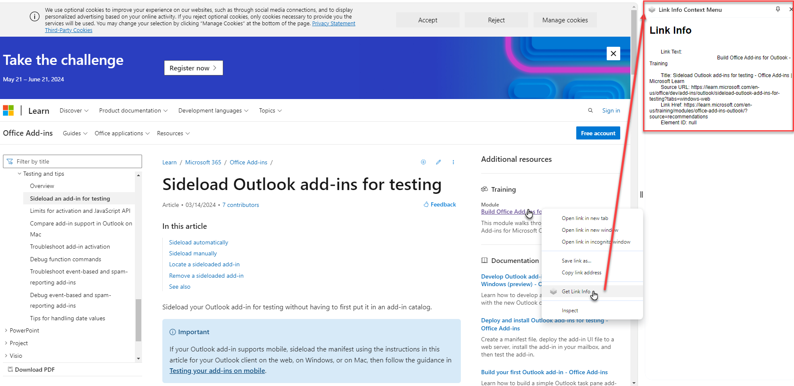
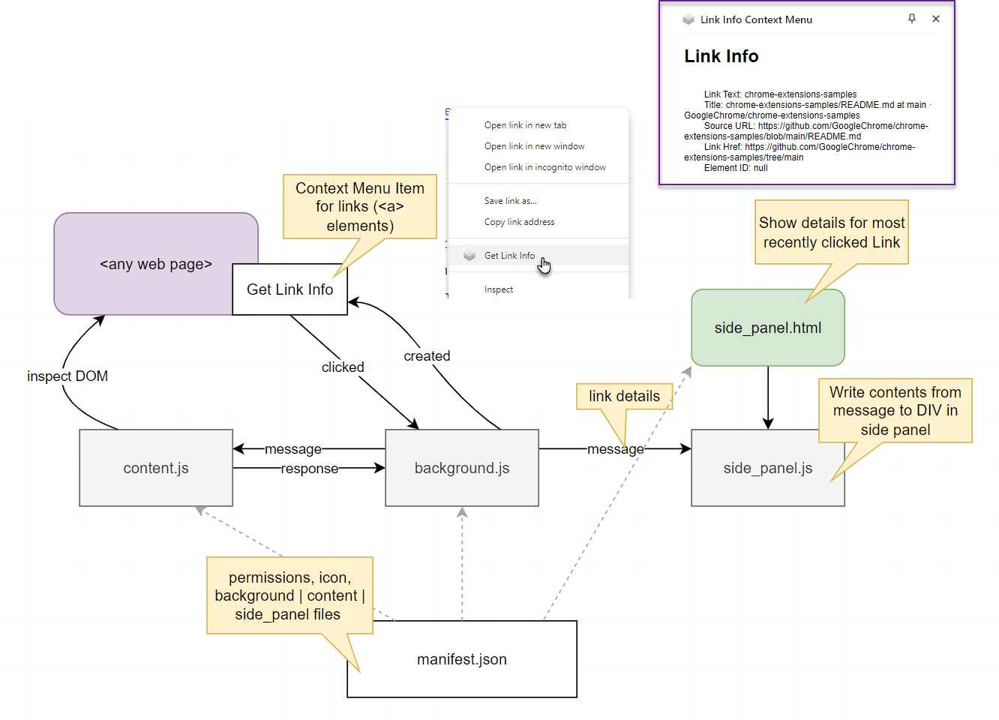
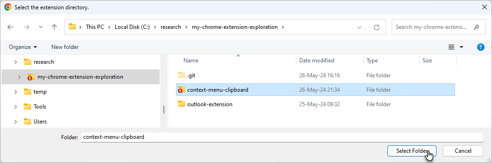
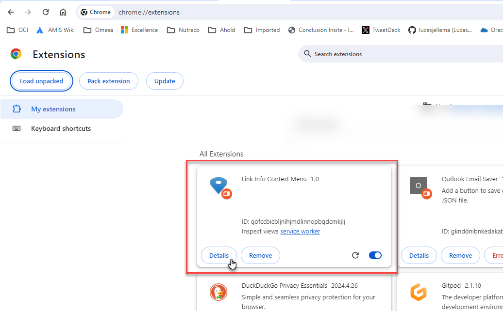
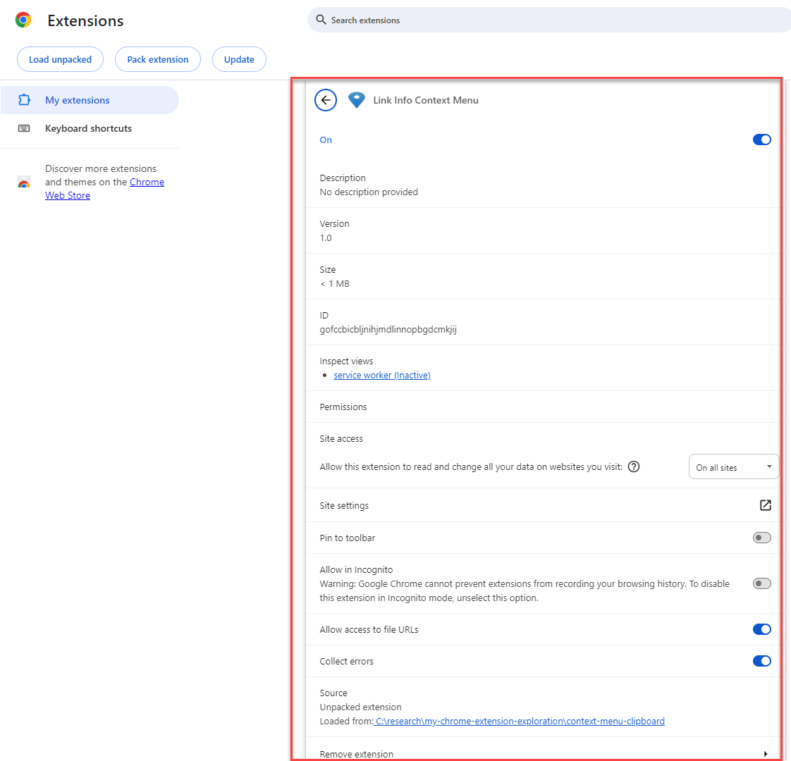
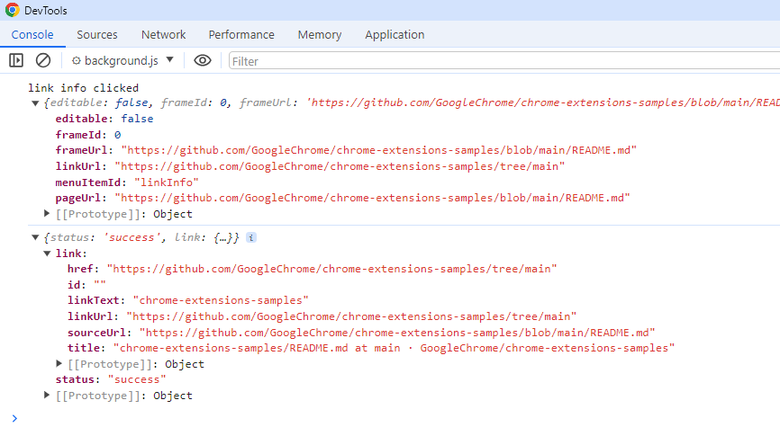
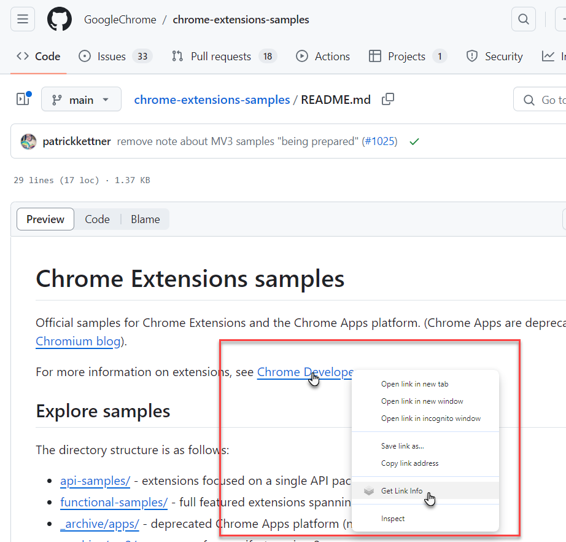

# Chrome Extension - Context Menu item for Links - Inspect DOM - Update Side Panel

This Chrome Extension adds a menu item to the context menu in case the menu is opened in the context of a link (an <a> element). When the item is activated, the properties of the link (text, url, title, ..) are captured from the DOM in the current document and displayed in the Side Panel.



The following mechanisms are at play:
* define permissions for contextMenus, sidePanel, activeTab and scripting in manifest.json
* define the context menu item in `background.js`
  * define the action to take when the item is cLicked: send message (to content.js), ask for link details, send response as message (to side_panel.js); the asynchronous single message-response is used with the active tab (where content.js listens for the message)
* in `content.js`: when a message of type *linkInfoRequest* is received, locate an `a` element in the DOM that has the same url as was passed from the link for which the context menu was clicked (or for which the link is within the local page itself and the combination of page source and local path is equal to the url from the context menu event); get the relevant details from that `a` element. NoteL: multiple elements can have that same `href` (url); the first one encountered in the DOM will be used. When the `<a>` is found and its properties are captured, a response message is sent (to `background.js`)
* the message is received in `background.js`. From it, a new message of type *linkInfo* is created and sent (to `side_panel.js`)
* in `side_panel.js` - the message is received and its contents is rendered in the `DIV` element (a little clunky but effective)

   

## Install the Extension

Open page chrome://extensions/ in Chrome
Switch to Developer Mode. This allows us to Load Unpackage Extensions (from a local file)
Click on Load Unpacked.


Select the folder on the file system that contains the extension - that is the folder that contains file `manifest.json`


The Extension is Loaded and a Card is added in the Extensions overview. 


Click on button Details.


The extension details and properties are shown and can be edited:

By clicking on the link `service-worker`, we can bring up a developer window with sources, debug and console for the actions of `background.js`. After we have activated the context menu for a link, this could be the output in the *console* tab:


The extension is activated for any page that is refreshed or newly loaded. You can find it in the context menu for any link element.


## Implementation Details

The context menu item is created in `background.js`

```
chrome.runtime.onInstalled.addListener(() => {
  chrome.contextMenus.create({
    id: "linkInfo",
    title: "Get Link Info",
    contexts: ["link"]
  });
});
```

The action to perform when the menu item is clicked is also defined in that file:
```
chrome.contextMenus.onClicked.addListener(async (info, tab) => {
  if (info.menuItemId === "linkInfo") {
    console.log('link info clicked ', info);
    await chrome.sidePanel.open({ tabId: tab.id }); // open the side panel in preparation for the link information

    (async () => {
      const [tab] = await chrome.tabs.query({active: true, lastFocusedWindow: true});
      // send message to console.js to ask for details from the DOM about the context link
      const response = await chrome.tabs.sendMessage(tab.id, { type: 'linkInfoRequest',href: info.linkUrl});
      console.log(response);
      // publish link details for use in side_panel.js
      chrome.runtime.sendMessage({
        type: 'linkInfo',
        linkText: response.link.linkText,
        title: response.link.title,
        sourceUrl: response.link.sourceUrl,
        href: response.link.href,
        id: response.link.id || null
      });
    })();
  }
});
```
The url of the link element for which the context menu item is activate is available in the info object in the linkUrl property. We do not have the ID value for the selected element (unfortunately). This linkUrl is included in the message (as *href*) that is sent *to the content.js script*.

In *content.js* - a listener is defined for messages of type `linkInfoRequest`:

```
chrome.runtime.onMessage.addListener((message, sender, sendResponse) => {
  console.log("Received message:", message);
  if (message.type === 'linkInfoRequest') {

    if (message.href) {
      console.log("Link received: ", message.href);
      const link = getLinkInfo(message.href);
      sendResponse({ status: 'success', link });
    }
    else {
      sendResponse({ status: 'error', message });
    }
  }
});
```
When the message is received, function getLinkInfo is invoked with the url from the href property in the incoming message. The resulting link object is sent as response - back to background.js.

Function getLinkInfo is nothing very special: it iterates over all a elements in the document and tries to find the one with the same href value as the message received from the context menu item. It first looks for external links with the right href and then tries for a elements that navigate within the page (combining the page source with the a element's href to together form the message's href ) :

```
function getLinkInfo(linkUrl) {
  console.log(`inside console.js `, linkUrl)

  let theLink
  const links = document.querySelectorAll(`a`);
  // print href for every link
  for (let i = 0; i < links.length; i++) {
    //    console.log(links[i].href);
    if (links[i].href == linkUrl) {
      console.log("Link found as global link: ", linkUrl);
      theLink = links[i];
      break;
    }
  }
  if (!theLink) {
    const linkUrlWithoutSource = linkUrl.replace(window.location.href, '');


    for (let i = 0; i < links.length; i++) {
      //    console.log(links[i].href);
      if (links[i].href == linkUrlWithoutSource) {
        console.log("Link found as local link: ", linkUrlWithoutSource);
        theLink = links[i];
        break;
      }
    }
  }

  if (theLink) {
    const linkElement = theLink;
    const linkText = linkElement.innerText || linkElement.textContent;
    const pageTitle = document.title;
    const sourceUrl = window.location.href;
    const id = linkElement.id;
    return {
      linkText: linkText,
      linkUrl: linkUrl,
      title: pageTitle,
      sourceUrl: sourceUrl,
      href: linkUrl,
      id: id
    };
  }


  return { linkUrl: "ELEMENT NOT FOUND" };
}
```
Note: this code is not nearly as elegant as it could be. But it works!

The message received in `background.js` is turned into a new message of type *linkInfo*

```
      const response = await chrome.tabs.sendMessage(tab.id, { type: 'linkInfoRequest',href: info.linkUrl});
      console.log(response);
      // publish link details for use in side_panel.js
      chrome.runtime.sendMessage({
        type: 'linkInfo',
        linkText: response.link.linkText,
        title: response.link.title,
        sourceUrl: response.link.sourceUrl,
        href: response.link.href,
        id: response.link.id || null
      });
  
```


and processed in `side_panel.js`:

```
chrome.runtime.onMessage.addListener((message, sender, sendResponse) => {
    if (message.type === 'linkInfo') {
      const contentDiv = document.getElementById('content');
      contentDiv.textContent = `
        Link Text: ${message.linkText}
        Title: ${message.title}
        Source URL: ${message.sourceUrl}
        Link Href: ${message.href}
        Element ID: ${message.id}
      `;
    }
  });
  ```

  This simple message receiver uses the contents of the message to update the DIV element with id == content, as defined in side-panel.html:

  ```
<!DOCTYPE html>
<html>
<head>
   ...
</head>
<body>
  <h1>Link Info</h1>
  <div id="content">No data received yet.</div>
  <script src="side_panel.js"></script>
</body>
</html>
```

The side panel finally is defined in `manifest.json`, along with the background.js and the content.js scripts, and the required permissions for this extension:

```
{
  "manifest_version": 3,
  "name": "Link Info Context Menu",
  "version": "1.0",
  "permissions": [
    "contextMenus",
    "activeTab",
    "scripting", "sidePanel"
  ],
  "background": {
    "service_worker": "background.js"
  },
  "content_scripts": [
    {
      "matches": ["<all_urls>"],
      "js": ["content.js"]
    }
  ],
  "action": {
    "default_icon": {
      "16": "icons/icon16.png",
      "48": "icons/icon48.png",
      "128": "icons/icon128.png"
    }
  },"side_panel": {
    "default_path": "side_panel.html"
  },
  "icons": {
    "16": "icons/icon16.png",
    "48": "icons/icon48.png",
    "128": "icons/icon128.png"
  }
}
```