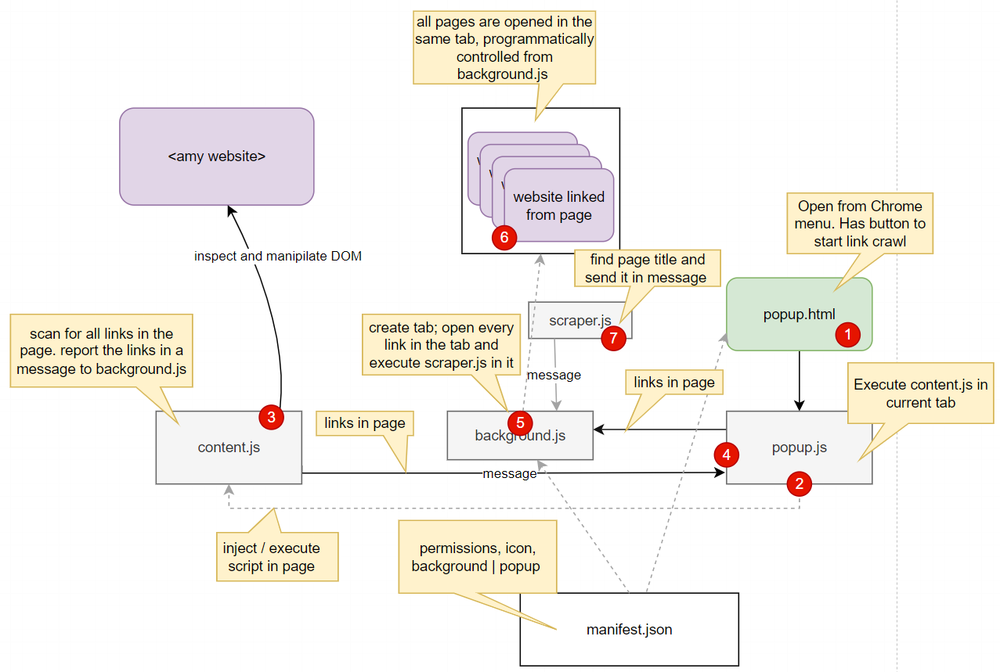
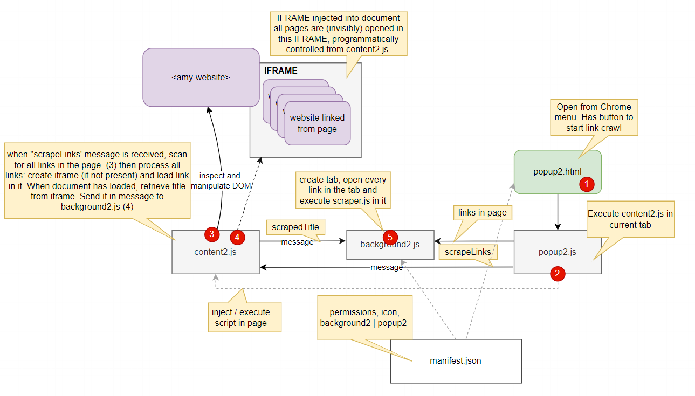

# Scrape Crawler

* open popup.html in context of current tab - then press button (1) 
* for current tab - scrape all the links (a elements)
  * popup.js executes script content.js in the context of the current tab (2)
  * script content.js collects the links and communicates them back to popup.js (3)
  * send links to background.js (4)
* visit all the pages linked to and collect their page titles
  * background.js receives the message with all links in a page;
    it processes these links one by one: 
    * navigate tab to each link (5)
    * execute scrape.js - to retrieve page title and send it in message (7)
    * receive message with page title and write to console.log 
  * execute scraper.js in context of page when the page has loaded
* 

This demonstrates how an extension can have an associated popup.html to provide interaction for end user.
It shows how from popup.js an action can be executed in the current page (content.js - injected/executed from popup.js)
It has background.js creating a tab and navigating to a page and injecting/executing a task once the document is loaded (scraper.js, coordinated from background.js)

Alternative implementation using an iframe in the content document to load all referenced pages,
implemented in popup2, content2, background2

Content2 still finds all link elemeents. Then it creates an IFRAME and loads the pages linked one by one into the IFRAME. WHen the page has loaded, the title is retrieved and reported in a message sent to background2.js.